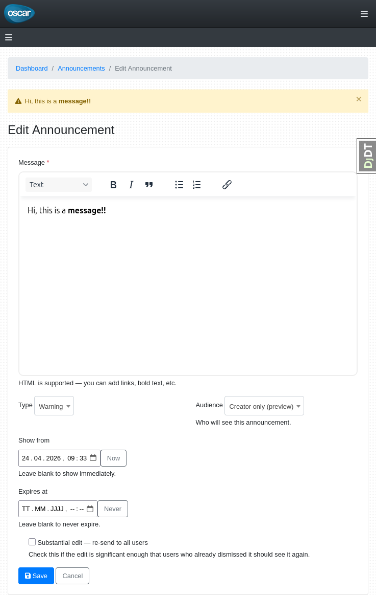
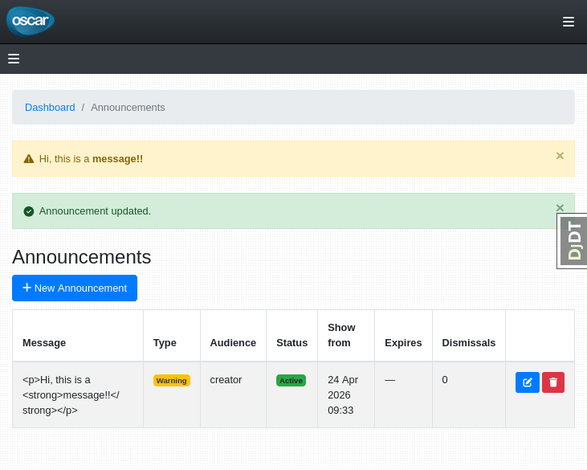

# django-oscar-announcements

Staff-managed site-wide announcements for [Django Oscar](https://github.com/django-oscar/django-oscar), built on top of [pinax-announcements](https://github.com/pinax/pinax-announcements).

Features:

* Dashboard CRUD (Customers → Announcements)
* **Info** (blue) and **Warning** (red) levels that match Oscar/Bootstrap alert colours
* Extensible **visibility** — built-in *Everyone*, *Registered*, and *Staff* audiences; add your own (e.g. *Verified*)
* AJAX dismiss with **no-JS form fallback**
* **Preview** — set audience to *Creator only* to see it on the public site before publishing to everyone
* **Re-send** checkbox — clear dismissals so users see it again after an edit
* Auto-delete via `cleanup_announcements` management command (or cron) when an expiry date passes




---

## Minimal configuration

Everything below is required for the package to work.

### 1. Install

```bash
pip install django-oscar-announcements
```

### 2. `INSTALLED_APPS`

```python
INSTALLED_APPS = [
    ...
    "pinax.announcements",   # required dependency
    "oscar_announcements",   # must come before oscar.config.Shop
    "oscar.config.Shop",
    ...
]
```

`oscar_announcements` must appear **before** `oscar.config.Shop` (and its sub-apps).
The package ships an override of `oscar/dashboard/partials/alert_messages.html`
that injects announcements into Oscar's `<div id="messages">`.
Django's app-directories loader searches apps in `INSTALLED_APPS` order, so if
Oscar comes first its own partial is found instead and announcements will not appear.

### 3. Context processor

Add to `TEMPLATES[0]["OPTIONS"]["context_processors"]`:

```python
"oscar_announcements.context_processors.announcements",
```

This populates `site_announcements` in every template context.

### 4. Dismiss URL

```python
# urls.py
from django.urls import include, path

urlpatterns = [
    ...
    path(
        "announcements/",
        include("oscar_announcements.urls", namespace="oscar_announcements"),
    ),
]
```

### 5. Wire into the Oscar dashboard

Subclass `DashboardConfig` to register the CRUD views and their permissions:

```python
# myapp/apps/dashboard/apps.py
from oscar.apps.dashboard.apps import DashboardConfig as OscarDashboardConfig


class DashboardConfig(OscarDashboardConfig):
    def configure_permissions(self):
        super().configure_permissions()
        from oscar_announcements.dashboard.urls import permissions as ann_permissions
        self.permissions_map.update(ann_permissions)

    def get_urls(self):
        from oscar_announcements.dashboard.urls import urlpatterns as ann_urls
        return super().get_urls() + self.post_process_urls(ann_urls)
```

Add a nav entry — the Customers section is index 3 in the default Oscar navigation:

```python
OSCAR_DASHBOARD_NAVIGATION[3]["children"].append(
    {"label": "Announcements", "url_name": "dashboard:announcement-list"}
)
```

### 6. Load JS in your base templates

The package automatically injects announcements into Oscar's
`<div id="messages">` on **both the public site and the dashboard** by
overriding `oscar/partials/alert_messages.html` and
`oscar/dashboard/partials/alert_messages.html`.

You still need to load `announcements.js` so the dismiss button works without
a full page reload. Create (or extend) both base templates in your project:

```html
{# myapp/templates/oscar/base.html — public site #}




    <script src=""></script>
    {{ block.super }}

```

```html
{# myapp/templates/oscar/dashboard/base.html — dashboard #}




    <script src=""></script>
    {{ block.super }}

```

---

## Configuration options

### Custom layout on the public site

**Purpose:** Render announcements with your own markup instead of the built-in
Bootstrap alert style.

By default the package overrides `oscar/partials/alert_messages.html` so
announcements appear automatically inside Oscar's `<div id="messages">` — you
don't need to add anything to your templates.

If you want full control over the markup, skip the automatic partial and call
`` directly in your own template:

```html



    <p class="oa-announcement--{{ ann.level }}">{{ ann.content }}</p>

```

Add the CSS if your site does not use Bootstrap:

```html
<link rel="stylesheet" href="">
```

---

### Anonymous visitors

**Purpose:** Show an announcement to every visitor — logged in or not.

Set *Audience* to **Everyone (including anonymous visitors)** in the dashboard
form.  Anonymous users see these announcements; authenticated users see them too.

Dismissals for anonymous users are stored in the session (no account required).
If the visitor later logs in, the announcement is automatically dismissed.

---

### Custom visibility audiences

**Purpose:** Restrict or extend who can see an announcement beyond the built-in
*Registered* and *Staff* options — for example, paying members.

Register a handler in your app's `AppConfig.ready()`:

```python
# myapp/apps.py
from oscar_announcements.visibility import register
from django.utils.translation import gettext_lazy as _

class MyAppConfig(AppConfig):
    def ready(self):
        register(
            "member",                            # stored value
            _("Members"),                        # label shown in the dashboard
            lambda user: getattr(user, "is_member", False) or user.is_staff,
        )
```

The new option appears automatically in the dashboard form's *Audience* dropdown.

---

### Expiry and automatic cleanup

**Purpose:** Remove announcements automatically once their expiry date has passed,
so the database does not accumulate stale records.

Run the management command from cron or a task scheduler:

```bash
python manage.py cleanup_announcements
```

Example cron entry (daily at 02:00):

```cron
0 2 * * * /path/to/venv/bin/python /path/to/manage.py cleanup_announcements
```

---

## Development

Setup:

```bash
git clone https://github.com/niccokunzmann/django-oscar-announcements
cd django-oscar-announcements
make dev
```

Run tests:

```bash
make test
```

Run the example site:

```bash
cd example
make .venv       # create venv, install deps, run migrations
make superuser   # create a superuser
make test        # run django system checks
make run         # start the dev server at http://localhost:8000
```

The example wires announcements into the Oscar dashboard via
[`example/example_site/apps.py`](example/example_site/apps.py).
Announcements appear inside Oscar's `<div id="messages">` automatically — the
package ships
[`oscar_announcements/templates/oscar/dashboard/partials/alert_messages.html`](oscar_announcements/templates/oscar/dashboard/partials/alert_messages.html)
which overrides Oscar's partial. CSS/JS are loaded in the example via
[`example/example_site/templates/oscar/dashboard/base.html`](example/example_site/templates/oscar/dashboard/base.html).

---

### Releases

Edit `CHANGES.md`, bump the version in `pyproject.toml`, then tag and push:

```bash
git tag v0.1.0
git push --follow-tags
```
